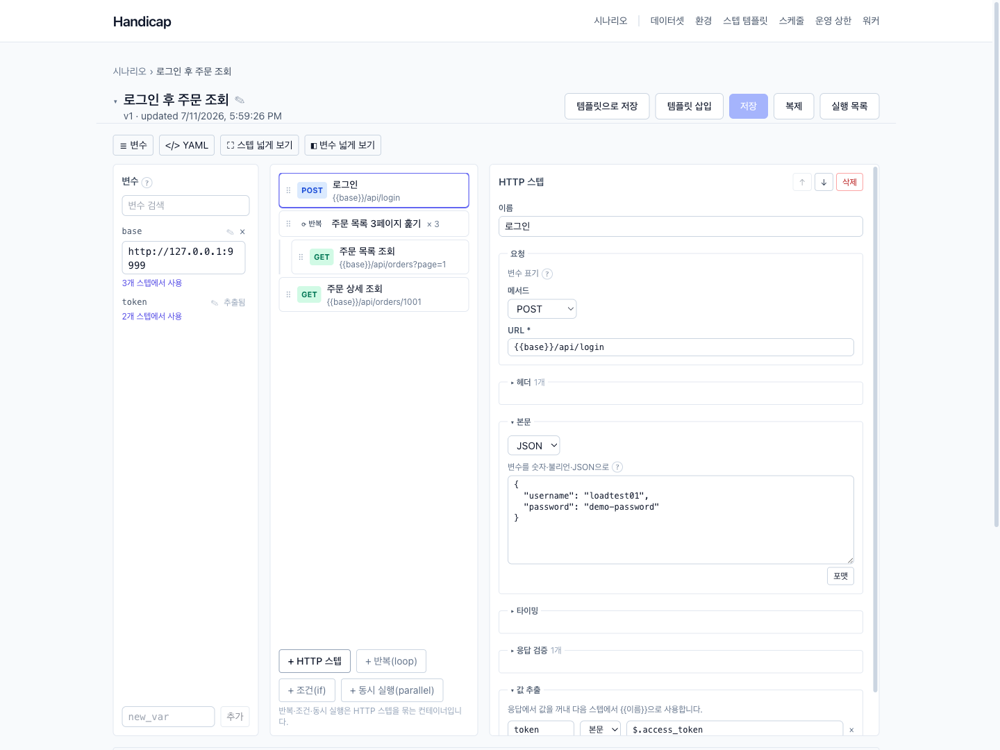
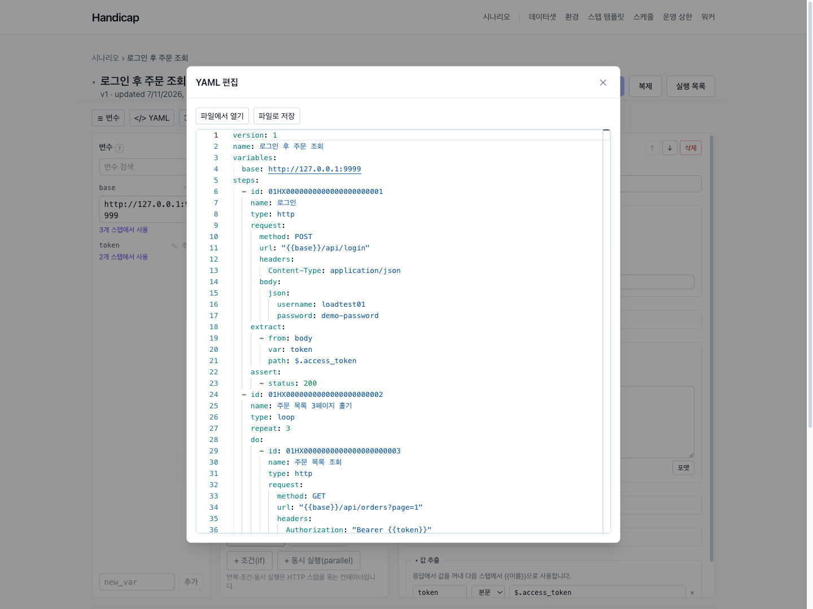
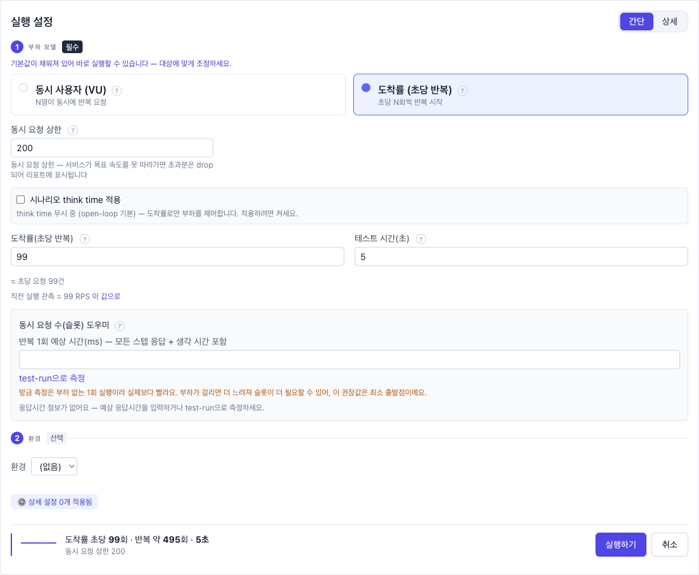
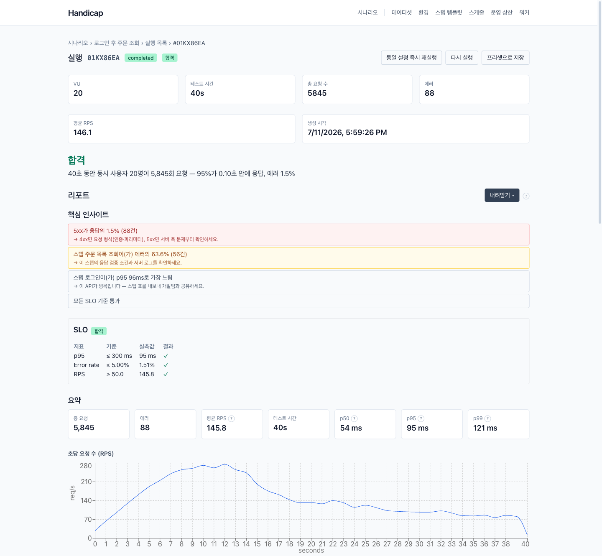
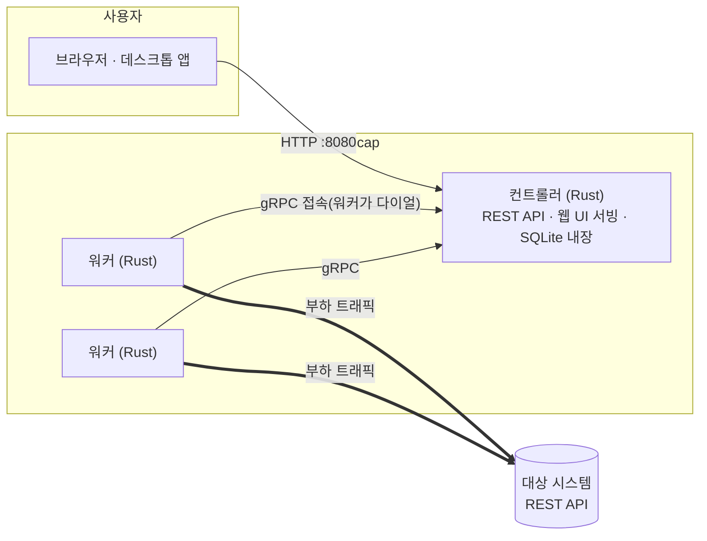

<div align="center">

# 🏇 Handicap

**QA는 드래그-드롭으로, 개발자는 YAML로 — 같은 시나리오를 함께 만드는 부하 테스트 도구**

경마에서 *핸디캡*은 강한 말에 중량을 더 얹어 진짜 실력을 가늠하는 제도입니다.
Handicap은 여러분의 시스템에 중량(부하)을 얹어, 장애가 나기 전에 한계를 알려줍니다.

[](https://github.com/SeonggukJeong/handicap/releases/latest)
[](LICENSE)


[**⬇ 다운로드**](https://github.com/SeonggukJeong/handicap/releases/latest) ·
[특장점](#-다른-도구와-무엇이-다른가) ·
[환경별 설치](#-시작하기--환경별-설치-절차) ·
[5분 튜토리얼](#-5분-튜토리얼--첫-부하-테스트) ·
[공공기관 도입 체크리스트](#-공공기관사내망-도입-체크리스트)

</div>



---

## 왜 만들었나

부하 테스트는 시스템 오픈 전 반드시 거쳐야 하는 관문인데, 정작 도구가 관문이 되곤 합니다.
상용 도구는 라이선스 비용이 부담스럽고 스크립트 작성법을 익히는 데만 몇 주가 걸리며,
오픈소스 대안은 대부분 **코드를 작성할 수 있는 사람**을 전제로 합니다.
그 사이에서 부하 테스트 담당자 혼자 모든 부담을 떠안는 모습을 보고 이 도구를 만들었습니다.

Handicap의 목표는 하나입니다 — **부하 테스트를 담당자 한 사람의 고통에서, 팀 전체의 일상적인 업무로 바꾸는 것.**

- **QA·운영 담당자**는 코드를 한 줄도 몰라도 화면에서 시나리오를 조립하고 실행합니다.
- **개발자**는 같은 시나리오를 YAML로 열어 편집하고, git으로 리뷰·버전 관리합니다.
- **기관**은 라이선스 비용 없이, 폐쇄망 안에서, PC 한 대로 시작해 필요한 만큼 확장합니다.

같은 고민을 하는 다른 조직·공공기관에도 도움이 되길 바라며 공개합니다.

---

## ✨ 다른 도구와 무엇이 다른가

### 1. 하나의 시나리오, 두 개의 편집기 (양방향 동기화)

Handicap의 핵심 설계입니다. 시나리오는 하나의 모델이고, 두 가지 뷰로 편집합니다.

- **GUI 에디터** — 스텝을 드래그-드롭으로 배치하고, 폼으로 요청·검증·변수 추출을 편집합니다. 코드 지식이 필요 없습니다.
- **YAML 뷰** — 같은 시나리오가 사람이 읽을 수 있는 YAML로 표현됩니다. 개발자는 익숙한 방식으로 편집하고, git에 커밋해 코드 리뷰와 이력 관리를 합니다.

두 뷰는 **실시간 양방향 동기화**됩니다. QA가 화면에서 스텝을 추가하면 YAML에 반영되고, 개발자가 YAML을 고치면 화면이 갱신됩니다. "QA용 도구 따로, 개발자용 도구 따로"가 아니라 **한 팀이 한 시나리오를 공유**합니다.



> 기존 도구와 비교하면 — 상용 도구의 스크립트 언어는 학습 장벽이 높고, JMeter는 GUI가 있지만 산출물(XML)을 사람이 읽기 어렵고, k6·Locust·Gatling은 처음부터 코드 작성이 기본입니다. GUI와 코드가 **같은 파일을 두고 왕복**하는 도구는 드뭅니다.

### 2. 설치 장벽이 사실상 없음

- **Windows**: [릴리즈 페이지](https://github.com/SeonggukJeong/handicap/releases/latest)에서 인스톨러(`.exe`/`.msi`)를 받아 설치하면 끝. 네이티브 앱 하나가 컨트롤러·워커·UI·DB를 전부 품고 있습니다.
- **서버(Linux)**: 바이너리 2개 + 정적 UI 폴더 1개. JVM도, Node도, 외부 DB도, 에이전트 설치도 필요 없습니다. DB는 SQLite가 내장되어 첫 실행 시 자동 생성·마이그레이션됩니다.
- 단일 실행 파일(portable exe)로도 빌드할 수 있어 **USB에 담아 옮기는 것**도 가능합니다.

### 3. 처음부터 한국어

UI 전체가 한국어입니다. 번역기를 돌린 게 아니라 **한국어 사용자를 1차 사용자로 설계**했습니다(메시지 카탈로그 일원화, 입력 검증 오류까지 한국어 매핑, 전문 용어는 원어 병기 + 도움말 툴팁). 부하 테스트를 처음 맡은 담당자도 매뉴얼 없이 화면을 따라갈 수 있게 하는 것이 목표입니다.

### 4. Rust 엔진 — 가볍고, 정확하게 잰다

부하 생성 엔진은 Rust + 비동기 런타임(tokio)으로 작성됐습니다. 가상 사용자(VU)마다 OS 스레드를 만들지 않아 메모리 사용이 낮고, 레이턴시는 HDR 히스토그램으로 정밀 집계합니다.

실측 예 (Apple Silicon macOS, 1 KB JSON 응답, 200 VU, 릴리즈 빌드 — [측정 절차](docs/dev/perf-bench.md)):

| 항목 | 수치 |
|---|---|
| 단일 워커 처리량 | **20,000+ RPS** |
| 레이턴시 | p50 8 ms / p95 17 ms / p99 24 ms |
| 컨트롤러 메모리 | ~15 MB |
| 워커 메모리 | ~33 MB (100 VU 기준) |

수 GB 힙 튜닝 없이, 사무용 PC 한 대로도 유의미한 부하를 만들 수 있습니다.

### 5. 전문 도구 수준의 부하 모델

"동시 사용자 N명"만으로는 표현할 수 없는 시험을 GUI에서 설정합니다.

- **Closed-loop (VU 모델)** — 동시 사용자 수 고정 + ramp-up. 여기에 **VU 곡선(단계별 증감)**으로 점진 증가·피크·감소를 설계할 수 있습니다.
- **Open-loop (도착률 모델)** — 목표 RPS를 지정하면 서버가 느려져도 도착률을 유지합니다. 서버가 느려지면 부하도 같이 줄어드는 closed-loop의 왜곡(coordinated omission)을 피해 **실제 트래픽에 가까운 시험**이 가능합니다. 다단계 램프(stages), 동시 in-flight 상한, 드롭 카운터 포함.
- **Think time** — 사용자 사고 시간을 run 전체 또는 스텝별로, 고정값/범위(시드 고정 재현 가능)로 부여.
- **타임아웃** — run 전역 + 스텝별 오버라이드.



### 6. 실무 시나리오를 그대로 옮기는 표현력

로그인 → 토큰 추출 → 인증 API 호출 같은 실제 업무 흐름을 그대로 만듭니다.

- **변수 추출**: 응답 본문(JSONPath)·헤더·쿠키·상태코드에서 값을 뽑아 다음 스텝에 주입 (`{{token}}`)
- **환경 분리**: `${BASE_URL}` 같은 환경 변수 세트를 dev/스테이징/운영별로 저장해 같은 시나리오를 재사용
- **제어 흐름**: 반복(loop) · 조건 분기(if/elif/else) · **동시 실행(parallel)** — 분기별 실행 횟수까지 리포트에 집계
- **데이터 주입**: CSV/엑셀(XLSX) 업로드 → VU별 고정 / 순차 / 랜덤 / **1회성(unique, 중복 소비 방지)** 4가지 정책으로 바인딩. 계정 1만 개로 로그인 부하 테스트 같은 시나리오가 바로 됩니다.
- **세션 자동 관리**: VU마다 독립 쿠키 저장소 — 세션 인증도 토큰 인증도 별도 설정 없이 동작
- **HAR 가져오기**: 브라우저 개발자도구로 녹화한 트래픽(HAR)을 시나리오로 변환 — 녹화 기반 작성
- **스텝 템플릿**: 자주 쓰는 스텝(예: 사내 SSO 로그인)을 템플릿으로 등록해 복사-삽입
- **시나리오 디버깅**: 에디터에서 **단발 테스트 실행** — 부하 없이 1회 실행해 실제 요청/응답 본문과 추출된 변수를 확인한 뒤 본 시험에 들어갑니다.

### 7. 리포트가 곧 결과 보고서

시험 종료 후 브라우저에서 바로 보는 리포트에 담기는 것:

- 1초 단위 시계열(RPS·레이턴시·에러·활성 VU), 스텝별 통계, HTTP 상태코드 분포, p50/p95/p99
- **요청 단계 분해** — DNS / 연결 / 서버 대기(TTFB) / 다운로드 구간별 시간 → "느린 게 네트워크인가 서버인가"를 리포트에서 판별
- **SLO 자동 판정** — "p95 ≤ 300 ms, 에러율 ≤ 1%" 같은 기준을 run에 걸어두면 결과에 **합격/불합격 배지**가 자동으로 붙습니다
- **Run 간 비교** — 개선 전/후 두 run을 나란히 비교, 차이(Δ)를 색으로 강조
- **CSV/XLSX 내보내기** — 비교 결과까지 엑셀(조건부 서식 포함)로 받아 보고서에 첨부
- 전 기능이 **JSON API**로도 제공 — CI 파이프라인에서 판정 결과로 배포 게이트를 걸 수 있습니다



> 라이브 대시보드는 의도적으로 뺐습니다 — 시험 *중* 관찰은 이미 쓰고 계신 APM이 더 잘합니다. Handicap은 시험 *후* 판정과 보고에 집중합니다.

### 8. PC 한 대에서 시작해, 필요한 만큼 확장

같은 시나리오 그대로, 배포 형태만 바꿉니다.

```
① 데스크톱 앱 / 단일 exe        →  담당자 PC 한 대 (에이전트·서버 불필요)
② LAN 분산 워커 풀              →  사무실 유휴 PC 여러 대를 묶어 부하 분산
③ Kubernetes (Helm 차트)        →  클러스터에서 멀티 워커 fan-out
```

LAN 풀은 워커 바이너리 **한 개**만 각 PC에 복사해 실행하면 자동 등록됩니다. 워커가 컨트롤러 쪽으로 접속하는 구조라 **워커 PC에 방화벽 인바운드를 열 필요가 없고**, 공유 토큰 인증·워커 대시보드(상태/용량/비우기/제외)·하트비트 기반 유령 워커 정리·**용량 초과 시 사전 차단**(요청 부하가 워커 풀 용량을 넘으면 run을 만들지 않고 "줄여 진행 / 강행" 선택지를 제시)까지 운영 기능이 갖춰져 있습니다.

### 9. 폐쇄망(air-gapped)에서 완결

공공기관·금융권의 망분리 환경을 처음부터 고려했습니다.

- 런타임 외부 의존이 **0** — 폐쇄망 반입물은 `controller` + `worker` 바이너리와 정적 UI 폴더뿐. Rust/Node/패키지 저장소가 폐쇄망 안에 필요 없습니다.
- CDN·외부 폰트·업데이트 체크·**텔레메트리 없음** — 외부로 아무것도 전송하지 않습니다. 모든 데이터는 로컬 SQLite 파일 하나에 저장됩니다.
- TLS는 rustls 내장 — 시스템 OpenSSL 설치도 불필요합니다.
- 트래픽 방향이 폐쇄망 친화적 — 부하는 아웃바운드, 워커→컨트롤러도 아웃바운드(다이얼), 기본 바인드는 `127.0.0.1`이라 웹 콘솔은 SSH 터널로 접근하면 **인바운드 방화벽 룰이 하나도 필요 없습니다**.

→ 상세 절차: [RHEL 폐쇄망 설치 매뉴얼](docs/dev/install-rhel-airgapped.md)

### 10. 반복 운영을 위한 장치들

- **Run 프리셋** — 자주 쓰는 부하 설정(VU/시간/SLO)을 시나리오별로 저장
- **스케줄러 내장** — cron 표현식(+ 시간대 지정)으로 야간·주말 정기 부하 테스트를 자동 실행
- **Run 감시** — 시작 후 무진행/예상 종료 초과 run을 자동 실패 처리(stall 배지), 워커 이상 종료 시 사유가 run에 기록
- **부하 정직성 원칙** — 설정한 부하와 다르게 발사될 상황(용량 부족 등)에서는 조용히 진행하지 않고, 실제 부하가 어떻게 달라지는지 설명하고 확인을 받습니다

### 한눈에 비교

| | 상용 도구 (LoadRunner 등) | JMeter | k6 (OSS) | **Handicap** |
|---|---|---|---|---|
| 비용 | VU 수 기반 고가 라이선스 | 무료 | 무료 (클라우드는 유료) | **무료 (MIT)** |
| 시나리오 작성 | 전용 스크립트 (학습 장벽 높음) | GUI 트리 (산출물은 XML) | JavaScript 코드 | **드래그-드롭 GUI ↔ YAML 양방향** |
| 비개발자 진입장벽 | 높음 | 중간 | 높음 (코드 필수) | **낮음 (GUI만으로 완결)** |
| 런타임 요구 | 전용 설치 | JVM | 단일 바이너리 | **인스톨러 또는 바이너리 2개** |
| 부하 생성 리소스 | — | 스레드-per-VU (대규모 시 힙 튜닝) | 가벼움 (Go) | **가벼움 (Rust·async)** |
| 한국어 UI | — | 없음 | 없음 | **기본** |
| 폐쇄망 구축 | 라이선스 서버 등 부담 | 가능 | 가능 | **산출물 반입만으로 완결** |
| SLO 판정·run 비교 | 상용 분석 도구 | 플러그인 조합 | 임계값 + 외부 연동 | **내장 (배지·비교·XLSX)** |

*(비교는 각 도구의 일반적인 OSS/기본 구성 기준이며, 버전에 따라 다를 수 있습니다.)*

---

## 🏗 아키텍처



- **컨트롤러**: 시나리오/run/리포트를 관리하고 웹 UI를 서빙하는 단일 바이너리. 저장소는 내장 SQLite(파일 1개), 스키마 마이그레이션은 바이너리에 임베드되어 자동 적용.
- **워커**: 부하를 실제로 생성하는 단일 바이너리. 메트릭을 1초 윈도우로 사전 집계(HDR 히스토그램)해 전송하므로 고부하에서도 수집 오버헤드가 낮습니다. 실행 형태는 3가지 — 컨트롤러가 자동으로 띄우는 **subprocess**(단일 PC), 상시 대기 **LAN 풀**, **K8s Job**.
- **UI**: React + TypeScript. 컨트롤러가 정적 파일로 서빙하므로 별도 웹 서버가 필요 없습니다.

---

## 🚀 시작하기 — 환경별 설치 절차

### 어떤 방식을 고를까

| 상황 | 추천 경로 |
|---|---|
| Windows PC에서 바로 써보고 싶다 (QA 담당자) | [A. Windows 데스크톱 앱](#a-windows--데스크톱-앱-권장) |
| 설치 없이 USB로 들고 다니고 싶다 | [B. 단일 실행 파일](#b-windows--단일-실행-파일-포터블) |
| macOS에서 쓰고 싶다 | [C. macOS](#c-macos) |
| 부서 공용 서버(Linux)에 상주시키고 싶다 | [D. Linux 서버](#d-linux-rhel-계열-서버) |
| 인터넷이 안 되는 폐쇄망에 설치해야 한다 | [E. 폐쇄망](#e-폐쇄망air-gapped) |
| PC 한 대로는 부하가 부족하다 | [F. LAN 분산 워커 풀](#f-lan-분산-워커-풀) |
| K8s 클러스터가 있다 | [G. Kubernetes](#g-kubernetes-helm) |

### A. Windows — 데스크톱 앱 (권장)

가장 쉬운 경로입니다. 빌드 도구가 전혀 필요 없습니다.

1. [최신 릴리즈](https://github.com/SeonggukJeong/handicap/releases/latest)에서 `Handicap_<버전>_x64-setup.exe`(NSIS) 또는 `.msi`를 내려받습니다.
2. 실행해 설치합니다.
   - **"Windows의 PC 보호" (SmartScreen) 경고가 뜨면**: 코드 서명이 없는 배포라 나타나는 정상 경고입니다. **"추가 정보" → "실행"**을 누르세요. (사내 배포 시 백신 allowlist 등록을 권장합니다.)
3. 시작 메뉴에서 **Handicap**을 실행하면 네이티브 창에 UI가 뜹니다. 컨트롤러·워커가 앱 안에 내장되어 있어 **별도 서버 없이 즉시 사용** 가능하며, 창을 닫으면 모든 프로세스가 함께 정리됩니다.

- 요구사항: Windows 10/11 (WebView2 런타임 — 최신 Windows에 기본 탑재, 없으면 [Microsoft Evergreen Bootstrapper](https://developer.microsoft.com/microsoft-edge/webview2/)로 설치)
- 데이터 위치: `%LOCALAPPDATA%\handicap\handicap.db` — 이 파일 하나가 전부입니다 (백업 = 복사)

### B. Windows — 단일 실행 파일 (포터블)

`handicap.exe` **한 파일**로 만들어 설치 없이 배포하는 방식입니다. 소스에서 빌드합니다 (Visual Studio Build Tools + Rust + protoc + Node 필요).

```powershell
# 빌드 (개발 PC에서 1회)
cd ui; pnpm install; pnpm build; cd ..
cargo build --release --features bundle
copy target\release\controller.exe handicap.exe
```

`handicap.exe`를 아무 PC에나 복사해 더블클릭하면 브라우저가 자동으로 열립니다(포트 사용 중이면 빈 포트 자동 배정, `--no-open`으로 자동 열기 해제). 단계별 상세 절차·문제 해결표: **[단일 실행 파일 빌드 가이드](docs/dev/single-exe-build.md)**

> 이 모드는 컨트롤러와 워커가 한 PC에서 돌아 라이트한 부하에 적합합니다. 고부하는 F(LAN 풀)·G(K8s)로.

### C. macOS

```bash
# 사전 준비: Xcode CLT + Rust + protoc + pnpm
xcode-select --install
curl --proto '=https' --tlsv1.2 -sSf https://sh.rustup.rs | sh -s -- -y
brew install protobuf just

# 단일 바이너리 빌드 & 실행
cd ui && pnpm install && pnpm build && cd ..
cargo build --release --features bundle
./target/release/controller        # 브라우저 자동 오픈
```

- 데이터 위치: `~/Library/Application Support/handicap/handicap.db`
- 네이티브 앱(`.app`)을 원하면: `cargo install tauri-cli --version "^2" --locked` 후 `cd desktop && cargo tauri build --bundles app` → [Tauri 빌드 런북](docs/dev/tauri-desktop-build.md)

### D. Linux (RHEL 계열) 서버

부서 공용 서버에 상주시키는 구성입니다. RHEL 10 기준 전체 절차(패키지 설치 → 빌드 → systemd 등록)는 **[RHEL 설치 매뉴얼](docs/dev/install-rhel.md)**에 있습니다. 요약:

```bash
# 1) 빌드 도구: gcc/make + protoc + Rust + Node≥20/pnpm  (OpenSSL dev 불필요 — rustls 내장)
sudo dnf install -y gcc gcc-c++ make pkgconf-pkg-config curl git
# protoc: EPEL의 protobuf-compiler 또는 GitHub 릴리스 zip
curl --proto '=https' --tlsv1.2 -sSf https://sh.rustup.rs | sh -s -- -y && . "$HOME/.cargo/env"

# 2) 빌드
cargo build --release -p handicap-controller --bin controller
cargo build --release -p handicap-worker     --bin worker
cd ui && pnpm install --frozen-lockfile && pnpm build && cd ..

# 3) 실행 (기본 바인드 127.0.0.1 — 외부 노출 없이 SSH 터널로 접근 권장)
./target/release/controller \
  --db /var/lib/handicap/handicap.db \
  --worker-bin ./target/release/worker \
  --ui-dir ui/dist
```

접속은 인바운드 포트를 열지 말고 SSH 로컬 포워딩을 권장합니다:

```bash
ssh -L 8080:127.0.0.1:8080 user@server   # 이후 브라우저에서 http://127.0.0.1:8080
```

### E. 폐쇄망(air-gapped)

핵심: **연결된 머신에서 빌드하고, 산출물 3개만 반입**합니다. 폐쇄망 안에는 Rust도 Node도 필요 없습니다.

```
target/release/controller    # 컨트롤러 바이너리
target/release/worker        # 워커 바이너리
ui/dist/                     # 정적 UI
```

```bash
# 폐쇄망 머신에서
/opt/handicap/controller \
  --db /var/lib/handicap/handicap.db \
  --worker-bin /opt/handicap/worker \
  --ui-dir /opt/handicap/ui-dist
# DB·스키마는 첫 실행 시 자동 생성 — 추가 반입물 없음
```

빌드 머신은 타겟과 같은 OS major·CPU 아키텍처를 권장합니다(glibc 호환). 사내 미러(Nexus/Artifactory)로 폐쇄망 내 빌드, 완전 오프라인 vendor 빌드, K8s 이미지 반입까지 포함한 전체 절차: **[폐쇄망 설치 매뉴얼](docs/dev/install-rhel-airgapped.md)**

### F. LAN 분산 워커 풀

사무실의 유휴 PC 여러 대를 부하 생성기로 묶습니다. 각 워커 PC에는 `worker` 바이너리 **한 개**만 있으면 됩니다.

```bash
# 컨트롤러 PC (두 포트 모두 LAN에 바인드 + 공유 토큰)
./controller --worker-mode pool \
  --rest 0.0.0.0:8080 --grpc 0.0.0.0:8081 \
  --worker-token <공유_비밀_키> \
  --ui-dir ui/dist --db handicap.db

# 각 워커 PC (컨트롤러 쪽으로 접속하므로 워커 PC 방화벽 개방 불필요)
./worker --controller http://<컨트롤러_IP>:8081 \
  --token <공유_비밀_키> \
  --worker-id office-pc-1 \
  --capacity-vus 500
```

run을 발사하면 컨트롤러가 유휴 워커 전원에 부하를 자동 분배합니다(워커별 선언 용량 존중, water-fill). 웹 UI의 **워커** 대시보드에서 각 워커의 상태·용량·마지막 응답을 보고, 비우기(drain)·용량 조정·제외를 즉석에서 제어할 수 있습니다. 요청 부하가 풀 용량을 넘으면 run을 만들지 않고 달성 가능한 값을 알려줍니다.

운영 상세(하트비트 튜닝, 제어 상태 영속화, 보안 한계): **[LAN 분산 워커 런북](docs/dev/lan-workers.md)**

> 참고: 워커 인증 토큰은 현재 평문 gRPC로 전송됩니다(접근 통제용). **신뢰할 수 있는 LAN 내부 전용**으로 운영하세요. mTLS는 로드맵에 있습니다.

### G. Kubernetes (Helm)

```bash
# 로컬 검증 (kind)
just deploy-kind
kubectl -n handicap port-forward svc/handicap-handicap-controller 8080:8080
# → http://127.0.0.1:8080

# 정리
just kind-down
```

운영 클러스터에는 `deploy/helm/handicap` 차트를 `helm upgrade --install`로 배포합니다. 워커는 컨트롤러가 **K8s Indexed Job**으로 필요할 때만 띄우고, run이 끝나면 사라집니다(상시 워커 리소스 점유 없음). 폐쇄망 클러스터는 이미지 반입 + `pullPolicy: IfNotPresent` — [폐쇄망 매뉴얼 §6](docs/dev/install-rhel-airgapped.md) 참고.

---

## ⏱ 5분 튜토리얼 — 첫 부하 테스트

1. **시나리오 만들기** — 좌측 메뉴에서 시나리오를 새로 만들고, 에디터에서 HTTP 스텝을 추가합니다. 메서드/URL/헤더/바디를 폼으로 입력하고, 응답에서 검증할 상태코드를 지정합니다.
2. **미리 확인** — **단발 테스트 실행**으로 부하 없이 1회 실행해 봅니다. 실제 요청과 응답 본문, 추출된 변수 값이 그대로 보이므로 시나리오가 맞는지 즉시 확인됩니다.
3. **부하 발사** — 실행 버튼을 누르면 Run 다이얼로그가 열립니다. 간단 모드에서 크기 칩(직전 실행 대비 0.5×/1×/2×)과 시간만 고르면 되고, 상세 모드에서 ramp-up·VU 곡선·목표 RPS·think time·SLO 기준까지 조정할 수 있습니다.
4. **리포트 확인** — 종료되면 리포트가 생성됩니다. 시계열 그래프, 스텝별 p95/p99, 상태코드 분포, SLO 합격/불합격 배지를 확인하고, 필요하면 CSV/XLSX로 내보냅니다.
5. **개선 후 재실험** — 서버를 튜닝하고 같은 프리셋으로 다시 실행한 뒤, **비교** 화면에서 두 run의 차이를 나란히 봅니다.

### 시나리오 YAML 맛보기

GUI에서 만든 시나리오는 이런 YAML이 됩니다 (반대로 이 YAML을 붙여 넣으면 GUI에 나타납니다):

```yaml
version: 1
name: 로그인 후 주문 조회
variables:
  base: ${BASE_URL}          # 환경(dev/스테이징/운영)에서 주입
steps:
  - id: 01HX0000000000000000000001   # 에디터가 자동 발급 (ULID)
    name: 로그인
    type: http
    request:
      method: POST
      url: "{{base}}/api/login"
      body:
        json:
          username: "{{user}}"        # 데이터셋(CSV/XLSX)에서 행 단위 주입
          password: "{{pass}}"
    extract:
      - from: body
        var: token
        path: $.access_token          # JSONPath로 토큰 추출
    assert:
      - status: 200
  - id: 01HX0000000000000000000002
    name: 내 주문 목록
    type: http
    request:
      method: GET
      url: "{{base}}/api/orders?page=1"
      headers:
        Authorization: "Bearer {{token}}"   # 앞 스텝에서 추출한 변수 사용
    assert:
      - status: 200
```

### REST API로 자동화 (CI 연동)

모든 기능은 REST API로도 사용할 수 있어, 배포 파이프라인에 성능 게이트를 넣을 수 있습니다:

```bash
# run 생성 (SLO 기준 포함) → 종료 후 판정 조회
curl -X POST http://127.0.0.1:8080/api/runs \
  -H "Content-Type: application/json" \
  -d '{"scenario_id":"<id>","profile":{"vus":50,"duration_seconds":300},"env":{}}'

curl http://127.0.0.1:8080/api/runs/<run_id>    # status·summary(p50/p95/p99·rps·errors)·SLO verdict
```

---

## 🏛 공공기관·사내망 도입 체크리스트

| 관점 | Handicap |
|---|---|
| 예산 | 라이선스 비용 없음. 부하 생성기도 유휴 PC 재활용 가능 |
| 망분리·폐쇄망 | 산출물 반입만으로 설치 완결, 외부 통신 0 ([절차](docs/dev/install-rhel-airgapped.md)) |
| 데이터 주권 | 모든 데이터가 로컬 SQLite 파일 1개. 외부 전송·텔레메트리 없음 |
| 네트워크 보안 | 기본 바인드 `127.0.0.1`(비노출), 부하·워커 트래픽 모두 아웃바운드, SSH 터널 접근 권장 |
| 담당자 교체 대응 | 한국어 GUI로 인수인계 부담 최소화 + 시나리오는 YAML로 문서화·버전 관리 |
| 감사·보고 | 리포트 XLSX 내보내기, SLO 판정 기록, run 이력 DB 보존 |
| 정기 점검 | 내장 cron 스케줄러로 야간·주기 시험 자동화 |

---

## 📌 정직하게 말하는 현재 한계

- **HTTP/REST 전용** — WebSocket·gRPC 부하는 아직 지원하지 않습니다 (로드맵).
- **라이브 대시보드 없음** — 설계상 제외. 시험 중 실시간 관찰은 APM을 병행하세요.
- **LAN 워커 채널 암호화 없음** — 공유 토큰은 접근 통제용이며 평문 전송됩니다. 신뢰 LAN 전용, mTLS는 후속.
- **Windows 인스톨러 코드 서명 없음** — SmartScreen 경고가 표시됩니다.
- **단일 컨트롤러** — HA 구성 미지원 (저장소의 PostgreSQL 전환과 함께 검토 예정).

---

## 📚 문서 지도

| 문서 | 내용 |
|---|---|
| [단일 실행 파일 빌드](docs/dev/single-exe-build.md) | Windows/macOS 포터블 exe 초보자용 절차 + 문제 해결 |
| [Tauri 데스크톱 빌드·릴리즈](docs/dev/tauri-desktop-build.md) | 데스크톱 앱 빌드, CI 릴리즈 절차 |
| [RHEL 설치](docs/dev/install-rhel.md) | Linux 서버 처음부터 빌드·실행 |
| [폐쇄망 설치](docs/dev/install-rhel-airgapped.md) | air-gapped/DMZ 반입 절차 3가지 경로 |
| [LAN 분산 워커 운영](docs/dev/lan-workers.md) | 풀 구성·용량 가드·대시보드 제어·하트비트 |
| [용량 계획](docs/dev/capacity-planning.md) | 부하 규모별 하드웨어 산정 |
| [성능 벤치](docs/dev/perf-bench.md) | 엔진 처리량 측정 절차·이력 |
| [docs/adr/](docs/adr/) | 아키텍처 결정 기록 45건 (왜 이렇게 만들었는가) |

---

## 🛠 개발자 가이드 (기여·소스 빌드)

```bash
# 요구: Rust stable (edition 2024 / MSRV 1.85) + protoc + just + Node≥20/pnpm
brew install protobuf just        # macOS 기준
just install-hooks                # 클론 후 1회 — pre-commit 게이트 설치

just build && just lint && just test          # Rust 워크스페이스
just ui-install && just ui-test               # UI

# 로컬 개발 실행 (핫 리로드)
just run-controller-with-ui                   # 단일 포트 8080
# 또는: 터미널 1) just run-controller  터미널 2) just ui-dev  → http://127.0.0.1:5173
```

- 저장소 구조: `crates/engine`(부하 엔진) · `crates/controller` · `crates/worker` · `crates/proto`(gRPC 정의) · `ui/`(React) · `desktop/`(Tauri 셸) · `deploy/helm`
- 설계 문서는 `docs/superpowers/specs/`, 결정 배경은 `docs/adr/`(MADR 포맷)에 있습니다.
- 이슈·PR 환영합니다. 버그 리포트에는 run 리포트 JSON과 컨트롤러 로그를 첨부해 주세요.

---

## 🗺 로드맵

WebSocket/gRPC 프로토콜 지원, LAN 워커 mTLS, PostgreSQL 저장소(HA), 리포트 심화 등이 검토·대기 중입니다. 상세: [docs/roadmap.md](docs/roadmap.md)

## 📄 라이선스

[MIT License](LICENSE) — 상업적 이용·수정·재배포·사내 개작 모두 자유롭습니다. 저작권 고지만 유지해 주세요. 도입 관련 문의는 이슈로 남겨주시면 됩니다.

---

<div align="center">

**Handicap** — 부하 테스트를 담당자 한 사람의 고통에서, 팀의 일상으로.

</div>
