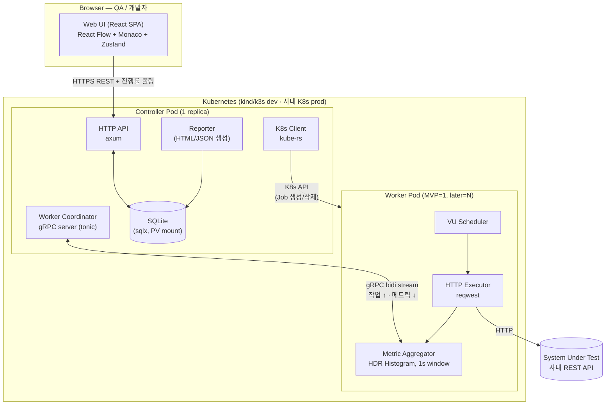

# Handicap MVP 1단계 — 설계 명세

- **상태**: 작성 완료 (전체 섹션)
- **날짜**: 2026-05-27
- **대상 범위**: MVP 1단계 (수직 슬라이스 전략, [ADR-0008](../../adr/0008-mvp-strategy-vertical-slice.md))
- **참조**: 전반 결정은 [ADR 인덱스](../../adr/README.md)

이 문서는 **MVP 1단계** 만의 설계다. 후속 단계(노드 종류 확장, 분산 자동화, 리포트 깊이 등)는 각자 별도 설계 문서를 가진다.

---

## 목차

1. 아키텍처 개요
2. 시나리오 데이터 모델
3. 구현 핵심 결정 (엔진·UI·리포트)
4. MVP 1단계 완료 기준

---

## 1. 아키텍처 개요

### 1.1 컴포넌트 다이어그램



### 1.2 컴포넌트 책임

| 컴포넌트 | 책임 | 책임 아닌 것 |
|---|---|---|
| **Web UI** (React SPA, Controller가 정적 서빙) | 시나리오 빌더(드래그-드롭 + YAML 양방향 sync), 실행 트리거, 진행률 폴링, 리포트 표시 | 부하 생성 |
| **Controller Pod** (Rust, 1 replica) | 시나리오 저장, run 오케스트레이션, 워커 lifecycle 관리, 메트릭 머지·저장, 리포트 생성 | 직접 부하 생성 |
| **Worker Pod** (Rust, MVP=1) | VU 스케줄링, HTTP 요청 실행, 응답 검증·변수 추출, 1초 윈도우 메트릭 집계 → 컨트롤러로 stream | 시나리오 저장, 리포트 생성 |
| **SQLite** (Controller 내장, PV) | 시나리오 YAML, run 메타, 워커가 보낸 집계 메트릭, 리포트 인덱스 | raw per-request 샘플 (ADR-0012 참조) |
| **K8s API** | 워커 Pod/Job 라이프사이클 | 비즈니스 로직 |

### 1.3 대표 실행 흐름

```
1. QA가 UI에서 시나리오 작성 → "Save"
   UI ─REST(POST /scenarios)─> Controller ─> SQLite

2. QA가 "Run with 100 VUs" 클릭
   UI ─REST(POST /runs)─> Controller
   Controller: SQLite에 run 레코드 생성 (status=pending)
   Controller ─K8s API─> Worker Job 생성

3. Worker Pod 시작 (Rust 바이너리)
   Worker ─gRPC connect─> controller.handicap.svc.cluster.local
   Worker가 자기 등록 (capacity 선언)

4. Controller가 작업 분배
   Controller ─gRPC stream─> Worker (시나리오 YAML, VU 수, ramp-up, duration)
   Controller: run status=running

5. Worker가 실행 (수십 초~수십 분)
   Worker (VU 1..N) ─HTTP─> Target API
   Worker: 1초마다 집계 메시지(HDR Histogram + status 분포 + 에러 카운트)
   Worker ─gRPC stream─> Controller (메트릭 메시지)

6. UI 폴링이 진행률 표시
   UI ─REST(GET /runs/:id)─> Controller ─> {status, progress%, current_rps}

7. Worker가 duration 끝나면 자체 종료
   Controller ─K8s API─> Job 삭제 (cleanup)
   Controller: run status=completed

8. Controller의 Reporter가 SQLite 데이터로 HTML 리포트 생성
   UI ─REST(GET /runs/:id/report)─> Controller ─> HTML
```

### 1.4 경계와 프로토콜

| 경계 | 프로토콜 | 근거 |
|---|---|---|
| Browser ↔ Controller | HTTPS REST + 1초 간격 폴링 | WebSocket 안 씀 ([ADR-0009](../../adr/0009-no-live-dashboard-mvp.md)). 폴링이면 충분 |
| Controller ↔ Worker | gRPC bidirectional stream (tonic) | [ADR-0010](../../adr/0010-controller-worker-grpc-pull.md) — 워커가 pull/등록 |
| Worker ↔ Target | HTTP/1.1 (또는 HTTP/2) | 테스트 대상 서비스 프로토콜 그대로 (reqwest 기본) |
| Controller ↔ K8s API | kube-rs | Job 리소스 CRUD |

### 1.5 MVP 1단계 In / Out

**IN — MVP 1단계에 포함**
- 시나리오 노드 1종: `HTTP request` (method, URL, headers, body, basic assertion: status code)
- 변수: env vars + 한 응답에서 JSON path로 값 추출 → 다음 요청에서 사용
- 실행: 컨트롤러 1 + 워커 1, k3s/kind 단일 노드에서 1k VU
- 메트릭: 1초 윈도우 RPS, 응답시간 p50/p95/p99, status code 분포, 에러 카운트
- UI: 드래그-드롭 캔버스 (1종 노드만), YAML 뷰, 양방향 sync, run 시작·진행률·리포트 페이지
- 저장: SQLite (컨트롤러 내장)
- 배포: Helm chart 1개, kind 단일 노드에서 동작

**OUT — 명시적으로 후속 단계**
- 다른 노드 종류 (POST 변형, loop, conditional, parallel) — 2단계
- 멀티 워커 + 자동 스케일(HPA) — 3단계
- LoadRunner급 리포트 깊이 (트랜잭션 분해·run 간 비교·SLA pass/fail) — 3단계
- 라이브 대시보드 ([ADR-0009](../../adr/0009-no-live-dashboard-mvp.md))
- WebSocket·gRPC·기타 프로토콜 ([ADR-0002](../../adr/0002-protocol-scope-rest-api-first.md))
- 인증·RBAC·멀티테넌트 (MVP는 네트워크 격리에 의존)
- 시크릿 관리 (env vars로 충분)

### 1.6 이 섹션에서 새로 결정된 사항

이 섹션 작업 중 다음 ADR이 추가되었다:
- [ADR-0010](../../adr/0010-controller-worker-grpc-pull.md) — gRPC bidi stream + 워커 pull/등록
- [ADR-0011](../../adr/0011-mvp-storage-sqlite.md) — SQLite (PostgreSQL 마이그레이션 경로 명시)
- [ADR-0012](../../adr/0012-worker-side-metric-aggregation.md) — 워커 측 1초 윈도우 집계, HDR Histogram

---

## 2. 시나리오 데이터 모델

### 2.1 핵심 원칙

**하나의 canonical model. GUI와 YAML은 그 모델의 두 뷰일 뿐, 어느 쪽도 진실의 단독 소유자가 아니다.** 이 원칙이 깨지면 sync는 결국 깨진다. 구체적 구현은 [ADR-0015](../../adr/0015-bidirectional-sync-impl.md).

### 2.2 Scenario vs Run Config (분리)

[ADR-0013](../../adr/0013-scenario-runconfig-separation.md) 에 따라 분리한다.

| 개념 | 무엇인가 | 누가 만드나 | 어디 저장 |
|---|---|---|---|
| **Scenario** | "VU 한 명이 무엇을 하는가" — HTTP 스텝·변수·추출 | QA가 GUI로 (개발자는 YAML로) | YAML, git |
| **Run Config** | "몇 명, 얼마나 빠르게, 얼마나 오래" — VU·ramp-up·duration·env | QA가 실행 다이얼로그에서 | DB (runs 테이블) |
| **Run** | 실제 실행 인스턴스 | 시스템 | DB + 메트릭 |

### 2.3 Scenario 스키마 (canonical YAML)

```yaml
version: 1
name: "User login then fetch profile"
variables:
  base_url: "https://api.internal.example.com"
steps:
  - id: "login"               # stable ULID (모델 ↔ 캔버스 매칭)
    name: "Login"
    type: http
    request:
      method: POST
      url: "{{base_url}}/auth/login"
      headers:
        Content-Type: application/json
      body:
        json:
          username: "${USERNAME}"
          password: "${PASSWORD}"
    assert:
      - status: 200
    extract:
      - var: token
        from: body
        path: "$.access_token"

  - id: "profile"
    name: "Get profile"
    type: http
    request:
      method: GET
      url: "{{base_url}}/users/me"
      headers:
        Authorization: "Bearer {{token}}"
    assert:
      - status: 200
```

MVP 필드 참조:

- `version`: 스키마 버전 (integer)
- `name`: 사람이 읽는 시나리오 이름
- `variables`: 시나리오 전체 기본 변수 map
- `steps[]`: 순차 실행 스텝 배열 (loop/conditional은 후속 단계)
- `steps[].id`: stable ULID, 자동 생성
- `steps[].type`: MVP는 `http`만
- `steps[].request.body`: `json` / `form` / `raw` 중 택일
- `steps[].assert[]`: MVP는 `status: <code>` 만
- `steps[].extract[]`: `from = body | header | status`; `path`는 JSONPath(body) 또는 헤더 이름

### 2.4 Run Config 스키마

```yaml
scenario_id: "01HX..."
profile:
  vus: 100
  ramp_up_seconds: 30
  duration_seconds: 300
env:
  BASE_URL: "https://staging.internal.example.com"
  USERNAME: "loadtest_user_${vu_id}"
  PASSWORD: "..."
```

### 2.5 변수·env·시스템 변수 표기

[ADR-0014](../../adr/0014-template-notation.md).

| 표기 | 의미 | 평가 시점 |
|---|---|---|
| `{{var}}` | `scenario.variables` 또는 extract된 흐름 변수 | 매 요청 직전, VU별 컨텍스트 |
| `${ENV}` | run config env var | run 시작 시 한 번 |
| `${ENV:-default}` | env var, 없으면 default | run 시작 시 한 번 |
| `${vu_id}` | 시스템: VU 순번 | 매 VU 시작 |
| `${iter_id}` | 시스템: VU의 iteration 순번 | 매 iteration |

### 2.6 GUI ↔ 모델 매핑

| 모델 요소 | 캔버스에서 |
|---|---|
| `scenario.variables` | 좌측 패널 Variables 섹션, 키-값 폼 |
| `scenario.steps[i]` | 캔버스 노드 1개 (id 기준) |
| `steps[i].name` | 노드 라벨 |
| `steps[i].type` | 노드 색상/아이콘 (MVP는 모두 `http` 동일) |
| `steps[i+1].id` | 노드 i에서 그어진 화살표의 대상 |
| 선택된 노드 | 우측 인스펙터에 request/assert/extract 폼 |
| `extract[].var` | 노드 우상단 "exports: token" 뱃지 |

후속 단계의 `loop`/`conditional` 노드는 모델에 `type: loop` 추가, 내부 `do: [...]` 중첩 — 캔버스에서는 컨테이너 노드로 시각화.

### 2.7 양방향 sync 메커니즘

[ADR-0015](../../adr/0015-bidirectional-sync-impl.md) 결정:

- **Zustand** 단일 store가 canonical state
- **Zod** schema로 TypeScript 타입과 런타임 validation 동시
- **`yaml` 패키지 Document API** 로 AST 기반 round-trip (코멘트·키 순서 보존)
- Monaco 편집은 **300ms 디바운스**, validation 실패 시 inline 에러 (store 미반영, 자유 편집 허용)
- 모든 스텝에 **stable ULID** — 편집·재정렬에도 노드 추적

### 2.8 알려진 MVP 한계

- YAML 코멘트가 "지워진 키 옆"에 있던 경우는 GUI 편집 후 손실 가능
- GUI가 표현하지 못하는 unknown 필드는 strict validation으로 거부 (k6 같은 자유 JS는 불가능)
- Binary body (파일 업로드) 미지원 — 후속 단계

### 2.9 SQLite 스키마 (MVP)

```sql
-- 시나리오 (YAML이 진실, DB는 캐시 + 검색용)
CREATE TABLE scenarios (
  id          TEXT PRIMARY KEY,        -- ULID
  name        TEXT NOT NULL,
  yaml        TEXT NOT NULL,           -- canonical YAML
  created_at  INTEGER NOT NULL,
  updated_at  INTEGER NOT NULL,
  version     INTEGER NOT NULL         -- 낙관적 락
);

-- run config + 실행 인스턴스
CREATE TABLE runs (
  id              TEXT PRIMARY KEY,
  scenario_id     TEXT NOT NULL REFERENCES scenarios(id),
  scenario_yaml   TEXT NOT NULL,       -- 실행 시점 snapshot
  profile_json    TEXT NOT NULL,       -- vus, ramp_up, duration
  env_json        TEXT NOT NULL,
  status          TEXT NOT NULL,       -- pending|running|completed|failed|aborted
  started_at      INTEGER,
  ended_at        INTEGER,
  created_at      INTEGER NOT NULL
);

-- 워커가 보낸 1초 윈도우 집계 메트릭
CREATE TABLE run_metrics (
  run_id           TEXT NOT NULL REFERENCES runs(id),
  ts_second        INTEGER NOT NULL,   -- unix timestamp, 1초 정렬
  step_id          TEXT NOT NULL,      -- scenario step id, 또는 "_all"
  count            INTEGER NOT NULL,
  error_count      INTEGER NOT NULL,
  hdr_histogram    BLOB NOT NULL,      -- HDR Histogram 직렬화 (응답시간 µs)
  status_counts    TEXT NOT NULL,      -- JSON: {"200": 950, "500": 50}
  PRIMARY KEY (run_id, ts_second, step_id)
);
```

`runs.scenario_yaml`을 snapshot으로 두는 이유: 시나리오가 수정돼도 과거 run 결과의 해석이 깨지지 않음 (git commit과 같은 원리).

### 2.10 이 섹션에서 추가된 ADR

- [ADR-0013](../../adr/0013-scenario-runconfig-separation.md) — Scenario / Run Config 분리
- [ADR-0014](../../adr/0014-template-notation.md) — 변수·env·시스템 변수 표기 분리
- [ADR-0015](../../adr/0015-bidirectional-sync-impl.md) — Zustand + Zod + YAML AST round-trip

## 3. 구현 핵심 결정 (엔진·UI·리포트)

세부 모듈 설계·함수 시그니처는 writing-plans 단계에서 다룬다. 이 섹션은 그 단계가 시작되기 전 잠겨야 할 **방향성 결정** 만 담는다.

### 3.1 Rust 엔진

**크레이트 구성**

```
crates/
  proto/         — gRPC .proto 정의, tonic-build로 생성된 코드
  engine/        — 부하 생성 핵심 라이브러리 (시나리오 실행, HTTP, 메트릭)
  controller/    — bin: HTTP API + Worker Coordinator + K8s client + Reporter
  worker/        — bin: VU Scheduler + Executor + Metric Aggregator
```

`engine`은 framework-agnostic 라이브러리 — `worker`가 사용. 후속에 CLI 모드 추가 시 그대로 재사용 가능.

**핵심 라이브러리**

| 용도 | 선택 | 근거 |
|---|---|---|
| Async runtime | tokio | Rust async 사실상 표준, tonic·reqwest 모두 tokio 기반 |
| HTTP client | reqwest (rustls TLS) | 친숙한 API, connection pool 내장. hyper 직접 사용은 MVP overkill |
| gRPC | tonic | tokio 기반, 검증됨 |
| HTTP server (Controller) | axum | tower middleware, tokio 친화 |
| K8s client | kube-rs | Rust K8s 표준 |
| DB | sqlx (SQLite 컴파일 타임 쿼리 검증) | PostgreSQL 마이그레이션 시 동일 API |
| Histogram | hdrhistogram | percentile 정확도 + 직렬화 |
| ID | ulid | 시간 정렬 + URL 안전 |
| Logging | tracing + tracing-subscriber | 구조화 로그, span으로 run/VU 추적 |
| YAML | serde_yaml | 시나리오 deserialize (UI의 yaml 패키지와는 다름) |
| Error | thiserror (라이브러리) + anyhow (binary edges) | 표준 패턴 |

**VU 실행 모델**: VU 1개당 tokio task 1개 — [ADR-0016](../../adr/0016-vu-execution-model-task-per-vu.md). 시나리오는 `async fn run(vu_id, ctx, scenario)` 형태.

**Ramp-up 곡선**: MVP는 linear. 매 초마다 `floor(target_vus / ramp_up_seconds)` 개의 task spawn.

**메트릭 집계 파이프라인**:
```
VU task ─┐
VU task ─┼─> per-step in-memory counter & HDR ─(1s flush)─> gRPC stream
VU task ─┘                                                       │
                                                                 ▼
                                                          Controller가 머지
```

### 3.2 웹 UI

**빌드·기본 라이브러리**

| 용도 | 선택 | 근거 |
|---|---|---|
| 빌드 | Vite | 빠른 dev server, React 친화 |
| 라우팅 | react-router | 화면 적음(시나리오 목록·편집·run·리포트) → 단순 |
| 상태 | Zustand | ADR-0015, 단순한 단일 store |
| Schema/validation | Zod | ADR-0015, TS 타입 + 런타임 동시 |
| Canvas (노드 그래프) | React Flow | 노드 그래프 표준, 드래그-드롭·줌·미니맵 내장 |
| 코드 에디터 | Monaco | YAML schema 기반 자동완성·에러 표시 가능 |
| YAML 처리 | `yaml` 패키지 (Document API) | ADR-0015, AST round-trip |
| HTTP client | fetch + React Query | 폴링 (1s 간격, run 진행률) |
| 차트 (리포트) | Recharts 또는 ECharts | 시계열 라인 + 막대. ECharts가 더 풍부, MVP는 Recharts로 시작 |
| 스타일 | Tailwind CSS | utility-first, 디자인 시스템 부담 적음 |

**화면 라우트** (MVP)

```
/                      → 시나리오 목록
/scenarios/new         → 새 시나리오 편집기
/scenarios/:id         → 시나리오 편집기 (캔버스 + YAML 탭)
/scenarios/:id/runs    → 해당 시나리오의 run 목록
/runs/:id              → run 상세 (진행 중: 진행률 / 완료: 리포트)
```

**컴포넌트 큰 그림** (디테일은 writing-plans)

- `ScenarioEditor` — 좌측 변수 패널, 가운데 캔버스↔YAML 탭, 우측 인스펙터
- `RunDialog` — 시나리오 선택 후 "Run" 클릭 시 모달 (VU·duration·env 입력)
- `RunDetail` — 진행 중에는 폴링하며 progress 표시, 완료 후 리포트 영역으로 전환
- `Report` — 요약 카드 + 시계열 그래프 3개 + 스텝별 테이블 + status 분포

### 3.3 리포트

[ADR-0017](../../adr/0017-mvp-report-scope.md) 참조.

**MVP 리포트 IN**
- 요약 카드: 총 요청·총 에러·전체 RPS·전체 p50/p95/p99·duration
- 시계열 그래프(1s 해상도): RPS · p95 응답시간 · 에러 카운트
- 스텝별 통계 테이블: 같은 메트릭 각 스텝별
- HTTP status code 분포 (막대 차트)
- 시나리오 snapshot YAML 표시
- Run config (VU·ramp-up·duration·env) 표시
- JSON 전체 다운로드 (raw 집계 데이터)

**MVP 리포트 OUT (후속 단계 명시)**
- Run 간 비교 차트 — 3단계
- SLA 정의·pass/fail 자동 판정 — 3단계
- 트랜잭션 시간 분해 (DNS/TCP/TLS/TTFB/다운로드) — 후속
- 워터폴 뷰, 백분위 히스토그램, CSV/Excel export — 후속

### 3.4 에러 처리 / 신뢰성

- **Worker 시나리오 단위 에러**: 시나리오 스텝의 HTTP 실패·assert 실패는 메트릭(`error_count`)으로 기록, 시나리오는 계속 진행 (다음 iteration). 부하 테스트의 일반 동작.
- **Worker 자체 panic**: tokio task panic → run 전체 fail로 마크하지 않고 해당 task만 종료. 일정 비율 이상 panic 시 worker가 자체 종료(`exit(1)`) — K8s Job이 재시작.
- **Worker ↔ Controller gRPC 끊김**: 지수 백오프로 재연결 시도. 60초 이상 끊기면 worker는 종료 (메트릭 손실 수용 — controller는 worker가 죽었음을 인지하고 run을 partial로 마크).
- **Controller panic**: Pod 재시작 후 SQLite에서 진행 중이던 run은 `failed`로 강제 마크 (실행 상태 복구 불가, MVP 수용).

### 3.5 테스트 전략

- **Unit**: `engine` 크레이트의 시나리오 인터프리터·템플릿 평가·메트릭 집계
- **Integration**: `worker`가 `controller`에 gRPC stream을 흘리는 흐름 (testcontainers로 작은 컨트롤러)
- **End-to-end**: kind 클러스터에 Helm 배포 → API로 시나리오 생성 → run → 리포트 JSON 검증. CI에서 자동 실행
- **UI**: vitest로 시나리오 모델 sync 로직 단위 테스트 (Playwright E2E는 후속 단계로 미룸)

### 3.6 이 섹션에서 추가된 ADR

- [ADR-0016](../../adr/0016-vu-execution-model-task-per-vu.md) — VU 1개당 tokio task 1개
- [ADR-0017](../../adr/0017-mvp-report-scope.md) — MVP 리포트 스코프

---

## 4. MVP 1단계 완료 기준

각 항목은 **PR 머지 전 충족되어야 하는 acceptance criteria**. 명시적·측정 가능하게.

### 4.1 사용자 흐름 (이걸 못하면 MVP 미완)

- [ ] QA가 빈 캔버스에 HTTP 노드 1개 끌어다 놓고 URL·method·헤더 입력 후 시나리오 저장 가능
- [ ] 저장된 시나리오를 YAML 탭에서 열면 같은 내용이 보임 (양방향 sync 1차 확인)
- [ ] 개발자가 YAML 탭에서 헤더 1줄 추가·저장 후 캔버스 탭으로 돌아가면 인스펙터에 반영
- [ ] "Run" 다이얼로그에서 100 VU / 30초 / env 1개 입력 후 실행 가능
- [ ] 실행 중 페이지에서 1초마다 진행률 % 와 현재 RPS 갱신
- [ ] 실행 종료 후 같은 페이지가 리포트로 전환: 요약 카드·시계열 3개·스텝별 테이블·status 분포 모두 표시
- [ ] 같은 시나리오를 1000 VU / 5분으로 재실행 가능, 새 run 페이지가 별도로 생성됨

### 4.2 기술 (배포·운영)

- [ ] `just deploy-kind` 한 명령으로 kind cluster에 Helm chart 배포 완료
- [ ] 컨트롤러 Pod 1 + 워커 Pod 1 구성으로 동작
- [ ] 컨트롤러 Pod 재시작 시 SQLite PV에서 시나리오·과거 run 목록 복구
- [ ] Worker가 비정상 종료 시 컨트롤러가 해당 run을 `failed` 로 마크 후 K8s에 Job 정리 요청
- [ ] gRPC stream 일시 끊김 시 워커가 지수 백오프(1·2·4·8s)로 재연결, 60초 후에는 종료

### 4.3 성능

- [ ] 단일 워커가 5,000 RPS 이상 유지 (대상: 1KB JSON 응답 GET, 동일 호스트)
- [ ] 메트릭 집계로 인한 throughput 오버헤드 5% 미만 (raw 비교)
- [ ] 컨트롤러 idle 메모리 256MB 이하, run 중 512MB 이하
- [ ] 1만 행 메트릭이 저장된 SQLite에서 리포트 페이지 초기 렌더 2초 이내

### 4.4 테스트·문서

- [ ] 각 Rust 크레이트(engine·controller·worker) 라인 커버리지 ≥ 60%
- [ ] UI: 시나리오 모델 양방향 sync 단위 테스트 (Zod validation, YAML round-trip)
- [ ] e2e: kind 환경에서 "시나리오 생성 → run → 리포트 JSON 검증" 전 흐름 자동 실행
- [ ] CI에서 위 unit·integration·e2e 모두 통과
- [ ] README quickstart: kind 설치 → Helm 배포 → 첫 시나리오 실행까지 명령 단위로 명시
- [ ] 모든 ADR이 `Accepted` 상태, CLAUDE.md 인덱스 최신

### 4.5 의도적으로 MVP 외 (다음 단계의 첫 후보)

- HTTP 외 다른 노드 종류 (POST 변형은 들어가지만 loop·conditional·parallel은 아님)
- 다중 워커 자동 스케일링 (워커는 1대 고정)
- LoadRunner급 리포트 깊이 (run 비교·SLA·트랜잭션 분해)
- 인증·RBAC·사용자 계정
- 라이브 대시보드
