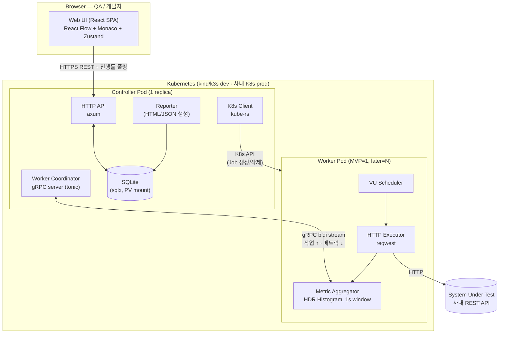

# Handicap MVP 1단계 — 설계 명세

- **상태**: 작성 진행 중 (섹션 1 완료)
- **날짜**: 2026-05-27
- **대상 범위**: MVP 1단계 (수직 슬라이스 전략, [ADR-0008](../../adr/0008-mvp-strategy-vertical-slice.md))
- **참조**: 전반 결정은 [ADR 인덱스](../../adr/README.md)

이 문서는 **MVP 1단계** 만의 설계다. 후속 단계(노드 종류 확장, 분산 자동화, 리포트 깊이 등)는 각자 별도 설계 문서를 가진다.

---

## 목차

1. 아키텍처 개요
2. 시나리오 데이터 모델 *(TODO)*
3. Rust 엔진 구조 *(TODO)*
4. 웹 UI 구조 *(TODO)*
5. 리포트 *(TODO)*
6. MVP 1단계 완료 기준 *(TODO)*

---

## 1. 아키텍처 개요

### 1.1 컴포넌트 다이어그램



### 1.2 컴포넌트 책임

| 컴포넌트 | 책임 | 책임 아닌 것 |
|---|---|---|
| **Web UI** (React SPA, Controller가 정적 서빙) | 시나리오 빌더(드래그-드롭 + YAML 양방향 sync), 실행 트리거, 진행률 폴링, 리포트 표시 | 부하 생성 |
| **Controller Pod** (Rust, 1 replica) | 시나리오 저장, run 오케스트레이션, 워커 lifecycle 관리, 메트릭 머지·저장, 리포트 생성 | 직접 부하 생성 |
| **Worker Pod** (Rust, MVP=1) | VU 스케줄링, HTTP 요청 실행, 응답 검증·변수 추출, 1초 윈도우 메트릭 집계 → 컨트롤러로 stream | 시나리오 저장, 리포트 생성 |
| **SQLite** (Controller 내장, PV) | 시나리오 YAML, run 메타, 워커가 보낸 집계 메트릭, 리포트 인덱스 | raw per-request 샘플 (ADR-0012 참조) |
| **K8s API** | 워커 Pod/Job 라이프사이클 | 비즈니스 로직 |

### 1.3 대표 실행 흐름

```
1. QA가 UI에서 시나리오 작성 → "Save"
   UI ─REST(POST /scenarios)─> Controller ─> SQLite

2. QA가 "Run with 100 VUs" 클릭
   UI ─REST(POST /runs)─> Controller
   Controller: SQLite에 run 레코드 생성 (status=pending)
   Controller ─K8s API─> Worker Job 생성

3. Worker Pod 시작 (Rust 바이너리)
   Worker ─gRPC connect─> controller.handicap.svc.cluster.local
   Worker가 자기 등록 (capacity 선언)

4. Controller가 작업 분배
   Controller ─gRPC stream─> Worker (시나리오 YAML, VU 수, ramp-up, duration)
   Controller: run status=running

5. Worker가 실행 (수십 초~수십 분)
   Worker (VU 1..N) ─HTTP─> Target API
   Worker: 1초마다 집계 메시지(HDR Histogram + status 분포 + 에러 카운트)
   Worker ─gRPC stream─> Controller (메트릭 메시지)

6. UI 폴링이 진행률 표시
   UI ─REST(GET /runs/:id)─> Controller ─> {status, progress%, current_rps}

7. Worker가 duration 끝나면 자체 종료
   Controller ─K8s API─> Job 삭제 (cleanup)
   Controller: run status=completed

8. Controller의 Reporter가 SQLite 데이터로 HTML 리포트 생성
   UI ─REST(GET /runs/:id/report)─> Controller ─> HTML
```

### 1.4 경계와 프로토콜

| 경계 | 프로토콜 | 근거 |
|---|---|---|
| Browser ↔ Controller | HTTPS REST + 1초 간격 폴링 | WebSocket 안 씀 ([ADR-0009](../../adr/0009-no-live-dashboard-mvp.md)). 폴링이면 충분 |
| Controller ↔ Worker | gRPC bidirectional stream (tonic) | [ADR-0010](../../adr/0010-controller-worker-grpc-pull.md) — 워커가 pull/등록 |
| Worker ↔ Target | HTTP/1.1 (또는 HTTP/2) | 테스트 대상 서비스 프로토콜 그대로 (reqwest 기본) |
| Controller ↔ K8s API | kube-rs | Job 리소스 CRUD |

### 1.5 MVP 1단계 In / Out

**IN — MVP 1단계에 포함**
- 시나리오 노드 1종: `HTTP request` (method, URL, headers, body, basic assertion: status code)
- 변수: env vars + 한 응답에서 JSON path로 값 추출 → 다음 요청에서 사용
- 실행: 컨트롤러 1 + 워커 1, k3s/kind 단일 노드에서 1k VU
- 메트릭: 1초 윈도우 RPS, 응답시간 p50/p95/p99, status code 분포, 에러 카운트
- UI: 드래그-드롭 캔버스 (1종 노드만), YAML 뷰, 양방향 sync, run 시작·진행률·리포트 페이지
- 저장: SQLite (컨트롤러 내장)
- 배포: Helm chart 1개, kind 단일 노드에서 동작

**OUT — 명시적으로 후속 단계**
- 다른 노드 종류 (POST 변형, loop, conditional, parallel) — 2단계
- 멀티 워커 + 자동 스케일(HPA) — 3단계
- LoadRunner급 리포트 깊이 (트랜잭션 분해·run 간 비교·SLA pass/fail) — 3단계
- 라이브 대시보드 ([ADR-0009](../../adr/0009-no-live-dashboard-mvp.md))
- WebSocket·gRPC·기타 프로토콜 ([ADR-0002](../../adr/0002-protocol-scope-rest-api-first.md))
- 인증·RBAC·멀티테넌트 (MVP는 네트워크 격리에 의존)
- 시크릿 관리 (env vars로 충분)

### 1.6 이 섹션에서 새로 결정된 사항

이 섹션 작업 중 다음 ADR이 추가되었다:
- [ADR-0010](../../adr/0010-controller-worker-grpc-pull.md) — gRPC bidi stream + 워커 pull/등록
- [ADR-0011](../../adr/0011-mvp-storage-sqlite.md) — SQLite (PostgreSQL 마이그레이션 경로 명시)
- [ADR-0012](../../adr/0012-worker-side-metric-aggregation.md) — 워커 측 1초 윈도우 집계, HDR Histogram

---

## 2. 시나리오 데이터 모델

*(다음 세션에서 작성)*

## 3. Rust 엔진 구조

*(TODO)*

## 4. 웹 UI 구조

*(TODO)*

## 5. 리포트

*(TODO)*

## 6. MVP 1단계 완료 기준

*(TODO)*
